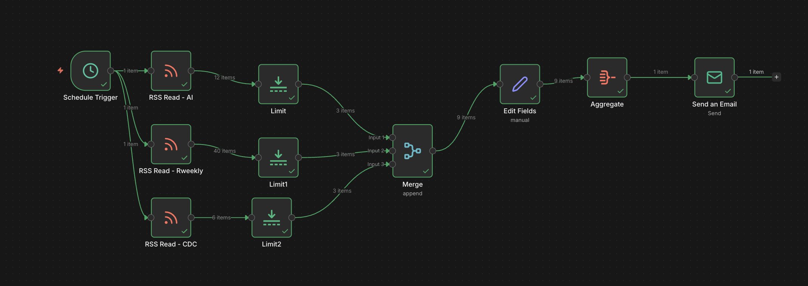

## Overview

:::: columns
::: {.column width="60%"}

### Why build a personal automation system?

Many people start exploring AI and automation by trying tools individually. They test a chatbot. They try an API. They read about agents.

But what really changes productivity is not a single tool. It is building a **small system** that works for you every day.
:::

::: {.column width="40%"}
{width=90%}
:::
::::

Automation can start with simple tasks like collecting signals, filtering information, and sending daily briefings. This article demonstrates how to build a **first automation assistant** using free infrastructure, creating a stable base for future expansion.

## The Idea: Start Simple and Expand

The first workflow we build is intentionally basic:

- **RSS feeds → filter articles → combine sources → send one daily email**

This teaches three fundamental ideas behind automation systems:

1. **Signal ingestion**
2. **Signal processing**
3. **Signal delivery**

Once this works, you can expand to include AI summaries, social media automation, research monitoring, and more.

## Why n8n and Oracle Cloud Free Tier?

### n8n
[n8n](https://n8n.io) is an open workflow automation tool similar to Zapier or Make, but with one crucial difference: you can host it yourself. This means:

- No subscription required
- Full control
- Unlimited workflows
- No vendor lock-in

### Oracle Cloud Free Tier
Oracle offers a generous free infrastructure tier, including:

- Always free virtual machines
- 1GB RAM instances
- Free storage
- Public IP
- Continuous availability

This is ideal for small automation servers.

## Architecture Overview

The system we create looks like this:

1. **Infrastructure layer**: Oracle VM
2. **Operating system**: Ubuntu
3. **Container runtime**: Docker
4. **Automation engine**: n8n
5. **Workflows**

This layered approach ensures simplicity and predictability.

## Step-by-Step Guide

### Step 1: Creating the Server

1. Choose Ubuntu 22.04 (Always Free eligible, 1GB RAM).
2. Connect using SSH:

   ```bash
   ssh -i KEY ubuntu@SERVER_IP
   ```

3. Update the system:

   ```bash
   sudo apt update && sudo apt upgrade -y
   ```

### Step 2: Installing Docker

1. Install Docker:

   ```bash
   sudo apt install docker.io -y
   ```

2. Enable Docker:

   ```bash
   sudo systemctl start docker
   sudo systemctl enable docker
   ```

3. Add your user to the Docker group:

   ```bash
   sudo usermod -aG docker ubuntu
   newgrp docker
   ```

### Step 3: Creating Persistent Storage

1. Create a folder for persistent data:

   ```bash
   mkdir -p ~/n8n_data
   ```

   This folder will store workflows, credentials, settings, and users.

### Step 4: Running n8n

1. Launch n8n:

   ```bash
   docker run -d \
   --name n8n \
   -p 5678:5678 \
   -v ~/n8n_data:/home/node/.n8n \
   --restart unless-stopped \
   docker.n8n.io/n8nio/n8n
   ```

2. Access n8n at **http://SERVER_IP:5678**.

### Step 5: Adding Swap for Stability

1. Create a swap file:

   ```bash
   sudo fallocate -l 2G /swapfile
   sudo chmod 600 /swapfile
   sudo mkswap /swapfile
   sudo swapon /swapfile
   ```

2. Make it persistent:

   ```bash
   echo '/swapfile none swap sw 0 0' | sudo tee -a /etc/fstab
   ```

## Building the First Workflow

The first workflow collects articles daily from sources like AI news, the R ecosystem, and research updates. It limits each source to 3 items, combines them, and sends one email.

### Workflow Structure

1. **Schedule trigger**
2. **RSS reader**
3. **Limit**
4. **Merge**
5. **Format**
6. **Aggregate**
7. **Email**

### Key Design Lessons

- **Limit early**: Apply limits to each source before merging.
- **Merge streams before reporting**: Combine feeds before aggregation.
- **Aggregate only once**: Filter and format data before aggregation.

## Disaster Recovery

Backup the `~/n8n_data` folder to ensure system recovery:

```bash
tar -czf n8n_backup.tar.gz ~/n8n_data
```

To restore:

1. Create a new VM.
2. Install Docker.
3. Restore the folder.
4. Restart the container.

**Recovery time: about five minutes.**

## Expanding the System

Once the foundation is stable, you can expand to include:

- AI summaries of articles
- Generating LinkedIn post ideas
- Tracking competitors
- Monitoring research papers
- Creating personal learning feeds

## Final Workflow Visualization

Below is a visual representation of the final workflow described in this post. This image illustrates the steps involved in the automation process:

{width=100%}

## Final Advice

- Start simple.
- Keep it stable.
- Expand gradually.

Automation grows best through iteration. Build one workflow, improve it, and then add more.


