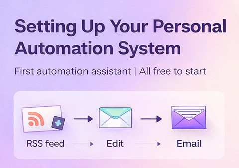

## Overview

:::: columns
::: {.column width="60%"}

### Why build a personal automation system?

Many people start exploring AI and automation by trying tools individually. They test a chatbot. They try an API. They read about agents.

But what really changes productivity is not a single tool. It is building a **small system** that works for you every day.
:::

::: {.column width="40%"}
{width=90%}
:::
::::


Something simple like:

- collecting signals
- filtering information
- sending a short daily briefing
- preparing ideas for writing or research

This is exactly how analysts, consultants, and research teams operate. The difference is that today we can build a lightweight version of this for ourselves.

In this article I show how to build a **first automation assistant** using only free infrastructure. The goal is not sophistication. The goal is to create a stable base you can expand later.

## The idea: start simple and expand

The first workflow we build is intentionally basic:

RSS feeds  
→ filter articles  
→ combine sources  
→ send one daily email

This may look simple, but it teaches the three fundamental ideas behind all automation systems:

**Signal ingestion**  
**Signal processing**  
**Signal delivery**

Once this works, you can add:

- AI summaries
- social media automation
- research monitoring
- lead tracking
- training content generation

The important part is the structure.

## Why n8n?

[n8n](https://n8n.io) is an open workflow automation tool similar to Zapier or Make, but with one crucial difference: you can host it yourself.

This means:

- no subscription required
- full control
- unlimited workflows
- no vendor lock-in

For learning automation, this is ideal.

## Why Oracle Cloud Free Tier?

Oracle offers a surprisingly generous free infrastructure tier that includes:

- Always free virtual machines
- 1GB RAM instances
- free storage
- public IP
- continuous availability

For small automation servers this is more than enough.

The important question is:

**Why choose the 1GB VM?**

Because our goal is not performance. It is stability and cost control.

A 1GB VM is enough for:

- n8n
- small workflows
- RSS ingestion
- email automation
- simple AI integrations

And it forces good engineering discipline:

- lightweight workflows
- efficient pipelines
- minimal overhead

In other words:

Small infrastructure encourages clean design.

## The architecture we are building

The system we create looks like this:

Oracle VM  
→ Ubuntu  
→ Docker  
→ n8n  
→ workflows

Visually:

Infrastructure layer  
Operating system  
Container runtime  
Automation engine  
Workflows

This layered approach makes recovery simple and predictable.

## Step 1 — Creating the server

We start by creating an Oracle Cloud VM:

Choose:

Ubuntu 22.04  
Always Free eligible  
1GB RAM  

Once created we connect using SSH:

```bash
ssh -i KEY ubuntu@SERVER_IP
```

After connecting we update the system:

```bash
sudo apt update && sudo apt upgrade -y
```

This is standard practice before installing anything.

## Step 2 — Installing Docker

Instead of installing n8n directly, we run it inside Docker.

This has major advantages:

- isolation
- easy upgrades
- easy recovery
- reproducibility

Install Docker:

```bash
sudo apt install docker.io -y
```

Enable it:

```bash
sudo systemctl start docker
sudo systemctl enable docker
```

Allow your user:

```bash
sudo usermod -aG docker ubuntu
newgrp docker
```

At this point Docker is ready.

## Step 3 — Creating persistent storage

This is the most important design decision.

We create a folder:

```bash
mkdir -p ~/n8n_data
```

### Why?

Because containers are disposable. Data is not.

This folder will contain:

- workflows
- credentials
- settings
- users

If you protect this folder, you protect the system.

## Step 4 — Running n8n

Now we launch n8n:

```bash
docker run -d \
--name n8n \
-p 5678:5678 \
-v ~/n8n_data:/home/node/.n8n \
--restart unless-stopped \
docker.n8n.io/n8nio/n8n
```

This means:

- Run container
- Expose port
- Mount storage
- Auto restart

We then access:

**http://SERVER_IP:5678**

Create the admin user and activate the community license.

Now the automation platform is ready.

## Step 5 — Making a small VM stable

A **1GB VM** can occasionally run out of memory. The simplest fix is adding swap.

### Create swap:

```bash
sudo fallocate -l 2G /swapfile
sudo chmod 600 /swapfile
sudo mkswap /swapfile
sudo swapon /swapfile
```

Make persistent:

```bash
echo '/swapfile none swap sw 0 0' | sudo tee -a /etc/fstab
```

This dramatically improves stability.

## Building the first workflow

The goal of the first workflow is simple:

Collect a few articles daily from:

- AI news
- R ecosystem
- Infectious disease research

Limit each source to 3 items.

Combine everything.

Send one email.

The workflow structure becomes:

Schedule trigger
→ RSS reader
→ Limit
→ Merge
→ Format
→ Aggregate
→ Email

This teaches a very important automation principle:

> "Always structure before adding complexity."

Key design lessons from the workflow

Three ideas matter more than the tools.

Limit early

We limit each RSS source individually.

Not:

Merge → Limit

But:

Limit → Merge

This preserves balance between sources.

Merge streams before reporting

Multiple feeds must be merged before aggregation.

Otherwise each source behaves independently.

Aggregate only once

Aggregation should happen only after filtering and formatting.

This produces one clean output.

What this simple workflow already teaches

Even a basic pipeline like this introduces real concepts used in larger systems:

- Data ingestion
- Filtering
- Quota allocation
- Stream merging
- Data transformation
- Report generation

These are exactly the same concepts used in:

- Data engineering
- Research monitoring
- Risk analytics
- AI pipelines

The scale changes. The logic does not.

Disaster recovery mindset

One of the most important lessons when building infrastructure is this:

Servers fail. Systems break. Humans make mistakes.

So we design for recovery.

In this setup only one thing really matters:

```bash
~/n8n_data
```

If this folder survives, the system survives.

Backup takes seconds:

```bash
tar -czf n8n_backup.tar.gz ~/n8n_data
```

If disaster happens:

- Create new VM
- Install Docker
- Restore folder
- Restart container

**Recovery time: about five minutes.**

This is why containerized systems are powerful.

## Why start this way instead of using SaaS automation?

Because building your own small system teaches:

- How workflows really operate
- How data moves
- How failures happen
- How to recover

And it removes cost pressure while learning.

Later you can always connect:

- OpenAI
- GitHub
- Google Drive
- Notion
- APIs

But the foundation remains yours.

What you can build next

Once this works, natural expansions include:

Adding AI summaries of articles.

Generating daily LinkedIn post ideas.

Tracking competitors.

Monitoring research papers.

Creating personal learning feeds.

The first workflow is not the goal.

It is the foundation.

## Final advice

Do not try to build everything at once.

Build:

- one workflow
- then improve it
- then add one more

Automation grows best through iteration.

- Start simple.
- Keep it stable.
- Expand gradually.

That is how systems become reliable.

## Closing thought

Automation is often presented as something complex or futuristic. In reality it starts with something very simple:

- Collect information.
- Structure it.
- Deliver it.

From there, intelligence can be added.

And that is exactly what we built here.

⸻

Future articles may expand this setup toward AI-assisted research workflows and personal knowledge systems.


